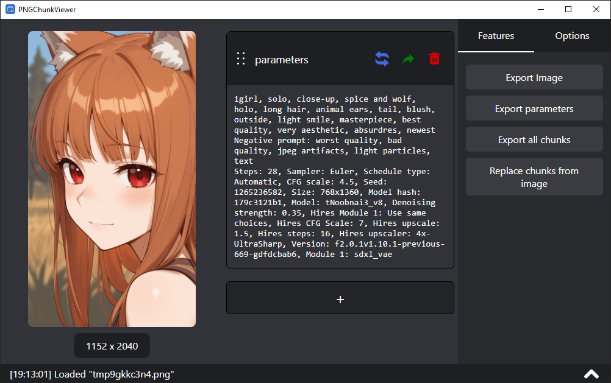
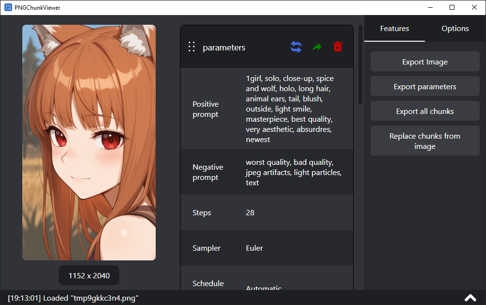

# PNGChunkViewer

A cross-platform desktop application built with **Tauri** + **React** + **Typescript**  that allows you to inspect, edit, and manipulate PNG chunks.  
It also includes a parser for [Stable Diffusion WebUI](https://github.com/AUTOMATIC1111/stable-diffusion-webui) generation tags, making it easy to extract and modify embedded prompt metadata.


## ✨ Features

- 📂 **Read PNG chunks** – view standard and custom chunks inside PNG files.  
- ✏️ **Edit or remove chunks** – modify text chunks directly.  
- 🖼️ **Stable Diffusion support** – parse and display generation parameters stored by SD WebUI (prompts, sampler, seed, etc.).  
- 💻 **Cross-platform** – runs on Windows, macOS, and Linux via **Tauri**.

## 🚀 Getting Started

### Prerequisites
- [Node.js](https://nodejs.org/) (>= 18)
- [Rust](https://www.rust-lang.org/) (for Tauri backend)
- [npm](https://www.npmjs.com/) or any other package manager

### Installation

```bash
# Clone the repository
git clone https://github.com/DHawk34/ChunkViewer.git
cd ChunkViewer

# Install dependencies
npm i

# Run in development mode
npm run tauri dev
```

## 🖼️ What you can do?

- Open a PNG file by clicking or drag & drop

- Edit (double click on chunk value), add, or remove chunks as needed

- If the image contains SD WebUI params, you can switch between structured and raw view modes

- Export SD WebUI params to txt file

- Save your changes and export the modified PNG

- Add custom chunk modification buttons (extensions) via json config file





## 🔧 How to create Extension?

1. Go to options
2. Click **Open extenstions folder**
3. Edit file `extensions.json`
4. Click **Reload extensions** in options

### Example
```json
{
  "$schema": "./extensions.schema.json",
  "chunkExtensions": [
    {
      "name": "example",
      "removeAllChunks": false,
      "chunksToRemove": [
        "delete me"
      ],
      "chunksToAdd": [
        {
          "name": "new awesome chunk",
          "value": "super text"
        }
      ]
    }
  ]
}
```